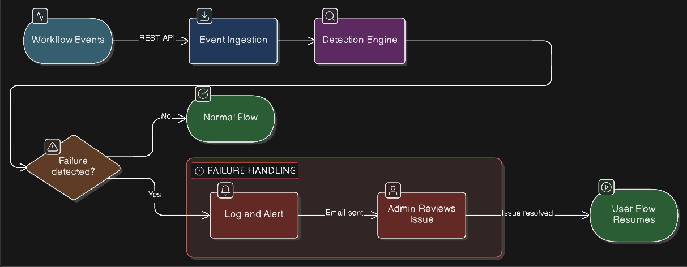
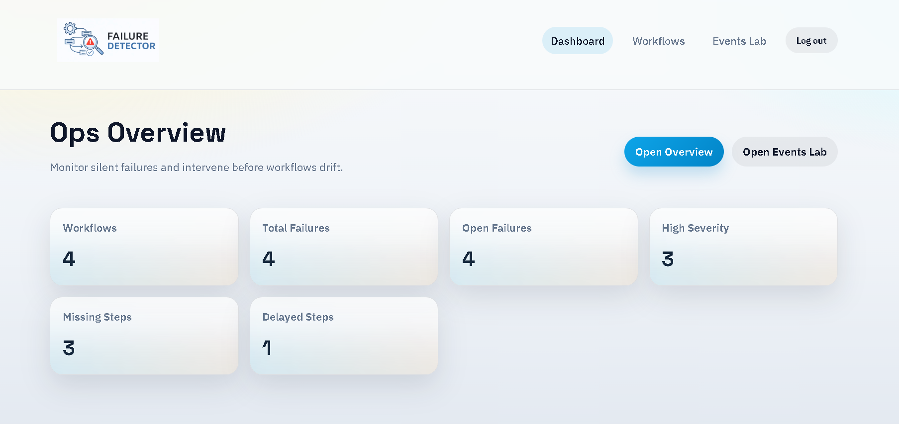
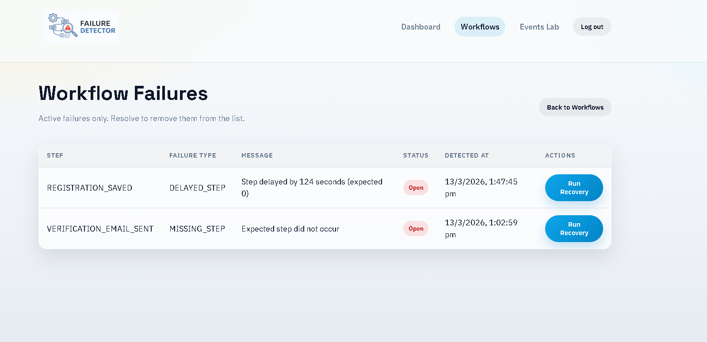
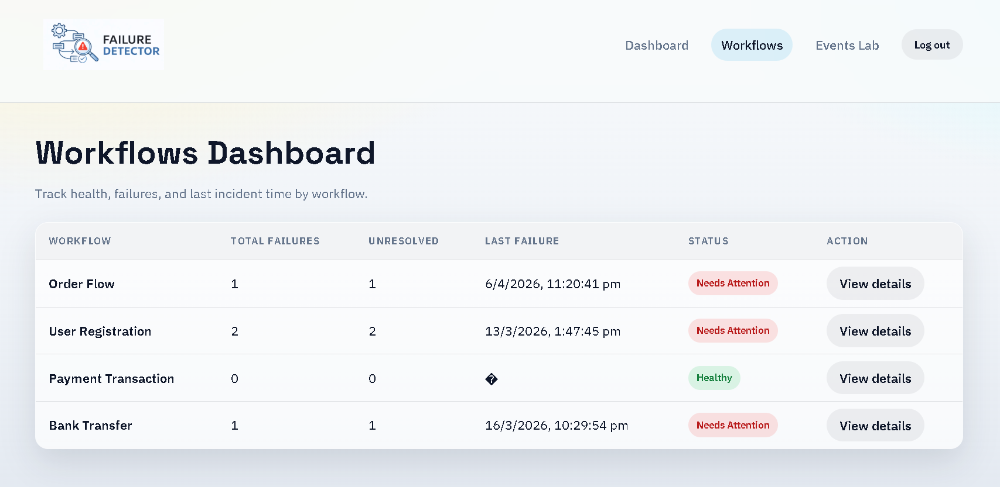
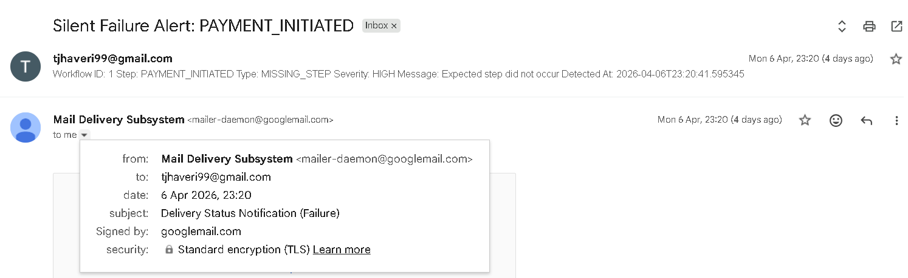
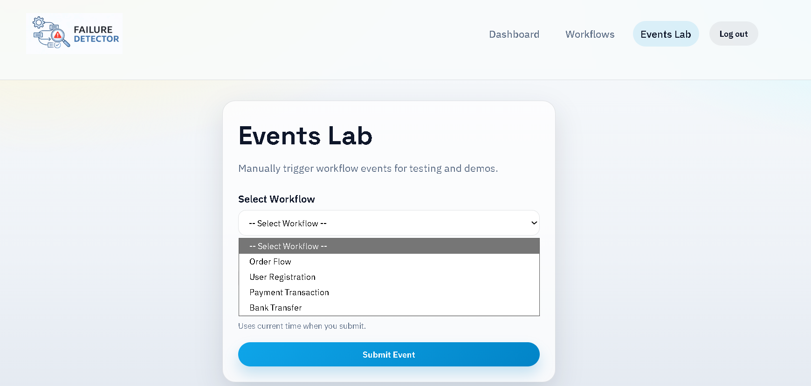

# 🔍 Failure Detector

> A real-time workflow monitoring system that detects missing or delayed steps, logs every failure, and instantly alerts administrators via email — so issues are resolved before users are ever impacted.

---

## 📑 Table of Contents

- [Overview](#-overview)
- [Features](#-features)
- [Tech Stack](#-tech-stack)
- [Project Structure](#-project-structure)
- [How It Works](#-how-it-works)
- [How to Run](#-how-to-run)
- [API Reference](#-api-reference)
- [Screenshots](#-screenshots)
- [Email Alert Format](#-email-alert-format)
- [Status](#-status)
- [Author](#-author)

---

## 📖 Overview

**Silent Failure Detector** is a full-stack application built to surface the invisible — workflow steps that fail without throwing any error. No crash. No exception. Just silence.

The system continuously monitors your workflow events and validates that each step arrives within its expected time window. When something is **missing** or **delayed**, it logs the failure, fires an email alert to the administrator, and keeps a full audit trail — so the team can investigate and resolve the issue before users are stuck.

> Whether it's a payment pipeline, an order fulfillment flow, or any multi-step automated process — this system makes sure nothing silently slips through.

---

## 🚀 Features

| # | Feature | Description |
|---|---|---|
| 1 | ⚡ Real-Time Monitoring | Tracks live workflow events and validates each step within expected time windows |
| 2 | 🔇 Silent Failure Detection | Catches failures with no error — missing steps, skipped stages, and stalled transitions |
| 3 | ⏱️ Delay Detection | Flags workflow steps running slower than their defined threshold |
| 4 | 📧 Email Alerts | Notifies administrators the moment a failure is detected |
| 5 | 🗓️ Automated Scheduler | Periodically scans for overdue steps without any manual trigger |
| 6 | 📊 Failure Dashboard | View all failures, filter by workflow or type, and mark them resolved |
| 7 | 🧪 Event Testing Module | Simulate workflow events to validate detection rules before going live |
| 8 | 📝 Failure Logging | Every failure is logged with workflow ID, step name, and timing details |

---

## 🛠️ Tech Stack

| Layer | Technology |
|---|---|
| **Backend** | Spring Boot (Java) |
| **Frontend** | React + TypeScript (Vite) |
| **Database** | MySQL |
| **Scheduling** | Spring Scheduler (`@Scheduled`) |
| **Email** | JavaMailSender (Spring Mail) |

---

## 🗂️ Project Structure

```
SilentFailureDetector/
└── demo/
    │
    ├── sfd-frontend/                    # ⚛️  React + TypeScript Frontend (Vite)
    │   ├── public/
    │   │   ├── image.png
    │   │   └── vite.svg
    │   ├── src/
    │   │   ├── api/                     # Axios API call definitions
    │   │   ├── components/              # Reusable UI components
    │   │   ├── hooks/                   # Custom React hooks
    │   │   ├── pages/                   # Dashboard, Logs, Test Module pages
    │   │   ├── types/                   # TypeScript type definitions
    │   │   ├── App.tsx
    │   │   ├── App.css
    │   │   ├── main.tsx
    │   │   └── index.css
    │   │   └── .env                     # Contains environment variables
    │   ├── index.html
    │   ├── package.json
    │   ├── tsconfig.json
    │   ├── tsconfig.app.json
    │
    └── src/main/                        # ☕  Spring Boot Backend
        ├── java/com/tirtha/sfd
        │   ├── controller/              # REST API controllers
        │   ├── config/                  # Includes configuaration for mail & DB & password
        │   ├── service/                 # Business logic & detection engine
        │   ├── scheduler/               # Automated failure scan scheduler
        │   ├── model/                   # JPA entity classes
        │   ├── dto/                     # Object used to transfer data between layers
        │   ├── repository/              # Spring Data JPA repositories
        |   ├── SilentFailureDetectorApplication.java
        └── resources/
            └── application.properties   # All app config (DB, mail, scheduler)
```

---

## ⚙️ How It Works

- This diagram explains the workflow:



**Step-by-step:**

1. Your services send workflow step events to the Failure Detector API.
2. The detection engine checks if each step arrives within its defined time window.
3. The scheduler runs at regular intervals to catch steps that never arrived at all.
4. When a failure is detected, it is logged to the database and an email is sent to the admin.
5. The admin reviews the failure on the dashboard, resolves it, and the user can proceed.

---

## ▶️ How to Run

### Prerequisites

Before starting, make sure you have the following installed:

- ☕ Java 17+
- 🔧 Maven
- 🗄️ MySQL 8+
- 🟩 Node.js 18+ *(for frontend only)*
---
### Step 1 — Clone the Repository

```bash
git clone https://github.com/your-username/SilentFailureDetector.git
cd SilentFailureDetector/demo
```
---
### Step 2 — Create the Database

```sql
CREATE DATABASE failure_detector;
```
---
### Step 3 — Configure the Backend

Edit `src/main/resources/application.properties`:

```properties
# ──────────────────────────────────────
# Database Configuration
# ──────────────────────────────────────
spring.datasource.url=jdbc:mysql://localhost:3306/failure_detector
spring.datasource.username=your_mysql_username
spring.datasource.password=your_mysql_password
spring.jpa.hibernate.ddl-auto=update

# ──────────────────────────────────────
# Email Configuration (Gmail)
# ──────────────────────────────────────
# ⚠️  IMPORTANT: Use a Gmail App Password — NOT your normal Gmail password.
#
#  How to generate an App Password:
#    1. Go to your Google Account → Security
#    2. Enable 2-Step Verification (mandatory)
#    3. Go to Security → App Passwords
#    4. Generate a password for "Mail"
#    5. Paste the 16-digit password below
#
spring.mail.host=smtp.gmail.com
spring.mail.port=587
spring.mail.username=your_email@gmail.com
spring.mail.password=your_16_digit_app_password
spring.mail.properties.mail.smtp.auth=true
spring.mail.properties.mail.smtp.starttls.enable=true

# ──────────────────────────────────────
# Scheduler Configuration
# ──────────────────────────────────────
scheduler.check.interval=60000
```
---
### Step 4 — Run the Backend

```bash
mvn spring-boot:run
```

> Backend API will be available at **`http://localhost:8080`**

---
### Step 5 — Run the Frontend

```bash
cd sfd-frontend
npm install
npm run dev
```

> Dashboard will be available at **`http://localhost:5173`**

---

## 🔌 API Reference

Base URL: `http://localhost:8080`

<br>

### 📨 Events

| Method | Endpoint | Description |
|---|---|---|
| `POST` | `/api/events` | Ingest a new workflow step event |
| `GET` | `/api/events?workflowId=1` | Fetch all events for a specific workflow |


### 📊 Failure Dashboard

| Method | Endpoint | Description |
|---|---|---|
| `GET` | `/api/dashboard/failures` | Fetch all logged failures |
| `GET` | `/api/dashboard/failures/workflow/{workflowId}` | Failures filtered by workflow |
| `GET` | `/api/dashboard/failures/type/{type}` | Failures filtered by type (`MISSING` / `DELAYED`) |
| `POST` | `/api/dashboard/failures/resolve/{id}` | Mark a specific failure as resolved |


### 🔍 Failure Detection

| Method | Endpoint | Description |
|---|---|---|
| `POST` | `/api/failures/detect/{workflowId}` | Manually trigger failure detection for a workflow |


### 🔄 Workflows

| Method | Endpoint | Description |
|---|---|---|
| `POST` | `/api/workflows` | Create a new workflow |
| `GET` | `/api/workflows` | Fetch all workflows |


### 🪜 Workflow Steps

| Method | Endpoint | Description |
|---|---|---|
| `POST` | `/api/workflow-steps` | Create a new workflow step |
| `GET` | `/api/workflow-steps?workflowId=1` | Fetch all steps for a specific workflow |


---

## 📸 Screenshots

> Replace the placeholder paths below with your actual screenshots.

| Dashboard Overview | Failure Logs |
|---|---|
|  |  |

| Workflow View | Email Alert | Add Event |
|---|---|
|  |  |  |

---

## 📧 Email Alert Format

When a failure is detected, the admin receives an email in this format:

```
Subject: ⚠️ Workflow Failure Detected — [Workflow Name]

──────────────────────────────────────
  SILENT FAILURE DETECTOR — ALERT
──────────────────────────────────────

Workflow  :  Order Processing Pipeline
Step      :  Payment Confirmation
Status    :  MISSING / DELAYED
Expected  :  Within 30 seconds of "Order Placed"
Detected  :  Step not received within threshold

Please investigate and resolve this issue at the
earliest to avoid further delay for the user.

──────────────────────────────────────
```
---

## 👤 Author

**Jhaveri Tirtha**

---

## 📄 License

This project is unlicensed. All rights reserved by the author.
